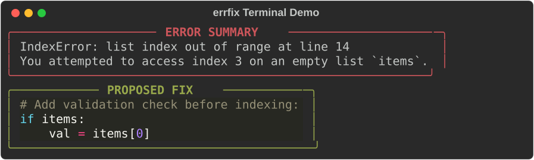
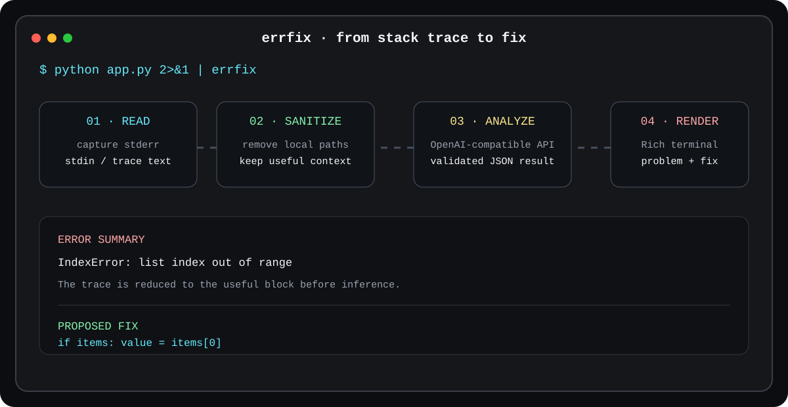

# errfix ⚡

> Stop reading walls of red terminal text. `errfix` pipes cryptic stack traces straight into lightweight AI for instant, 2-line problem breakdowns and actionable fixes.




---

## What it does

`errfix` sits at the end of a failing command's stderr stream, removes local-path details, extracts the useful trace, asks an OpenAI-compatible model for a concise explanation, validates the response, and renders the result as a clean terminal answer.



## Quick Demo

```bash
# Pipe any failing command directly into errfix
python app.py 2>&1 | errfix
```

```text
╭───────────────────── ERROR SUMMARY ─────────────────────╮
│ IndexError: list index out of range at line 14          │
│ You attempted to access index 3 on an empty list items. │
╰────────────────────────────────────────────────────────╯
╭────────────────────── PROPOSED FIX ─────────────────────╮
│ Add a check before indexing:                            │
│ if items:                                               │
│     val = items[0]                                      │
╰────────────────────────────────────────────────────────╯
```

## Key Features

- **Multi-language support** — extracts and parses traces from Python, Node.js, Go, and Rust.
- **Privacy first** — regex redacts local machine paths (`/Users/...`, `/home/...`, `C:\Users\...`) and home shortcuts before anything is sent.
- **Rich terminal formatting** — syntax-highlighted panels that degrade to plain text when color is unavailable.
- **Stdin protection** — TTY detection prints a usage panel and exits instead of hanging when there is no pipe.
- **Defensive model handling** — accepts raw or fenced JSON and validates the required `problem` and `fix` fields.
- **Persistent key storage** — prompts on first run and saves to `~/.errfixrc` (mode `0600`). Use `errfix --reset-key` to overwrite.

## Installation

```bash
git clone https://github.com/aydanmoussa74-a11y/errfix.git
cd errfix
pip install -e .
```

## Usage Examples

Python:

```bash
python script.py 2>&1 | errfix
```

Node.js / JavaScript:

```bash
node app.js 2>&1 | errfix
```

Go:

```bash
go run . 2>&1 | errfix
```

Rust / Cargo:

```bash
cargo run 2>&1 | errfix
```

Reset API key:

```bash
errfix --reset-key
```

Optional inference settings:

```bash
export ERRFIX_API_KEY="your_key_here"
export ERRFIX_API_URL="https://openrouter.ai/api/v1/chat/completions"
export ERRFIX_MODEL="meta-llama/llama-3-8b-instruct:free"
```

## Technical Docs & Contributing

- [ENGINEERING.md](ENGINEERING.md) — data pipeline, sanitizer rules, LLM constraints, and Rich rendering.
- [CONTRIBUTING.md](CONTRIBUTING.md) — local setup, branch names, tests, and pull-request guidelines.

## License

MIT © Zayd Moussa (2026)
